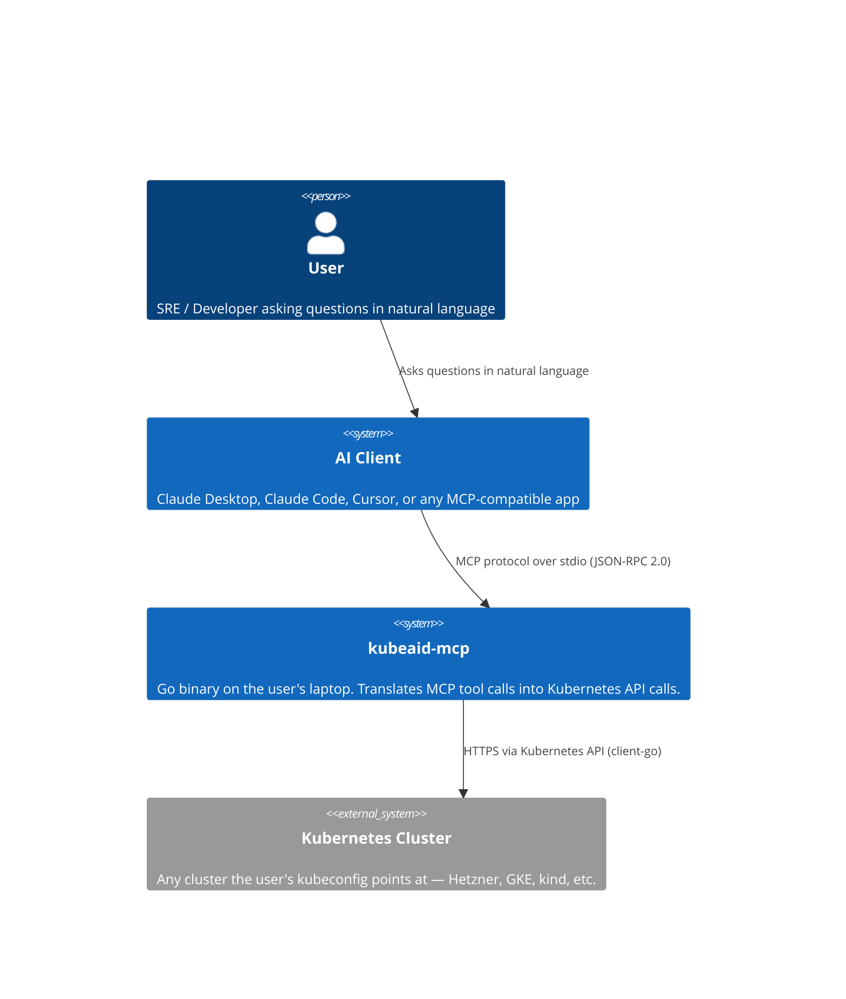
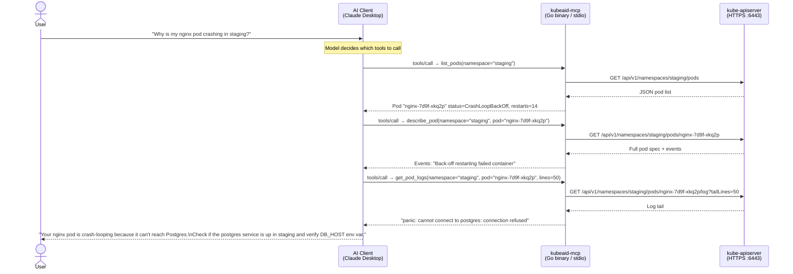
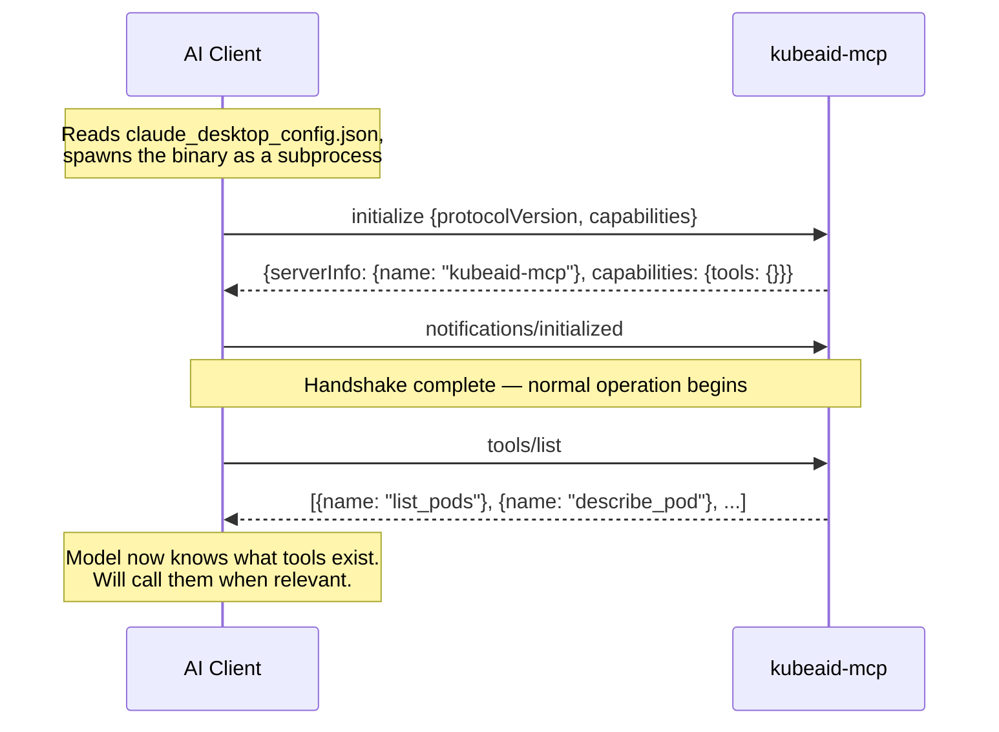
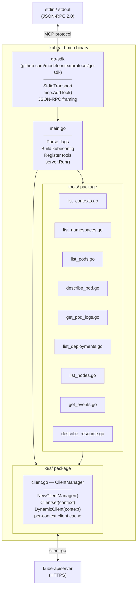
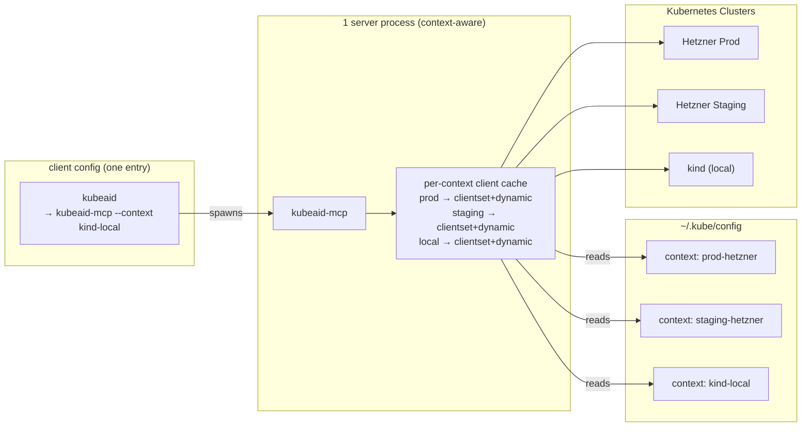
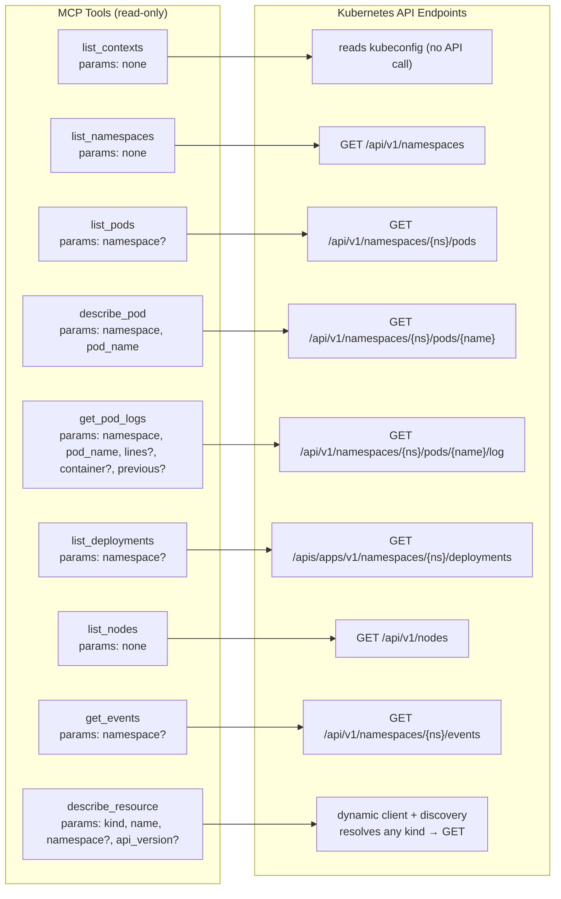
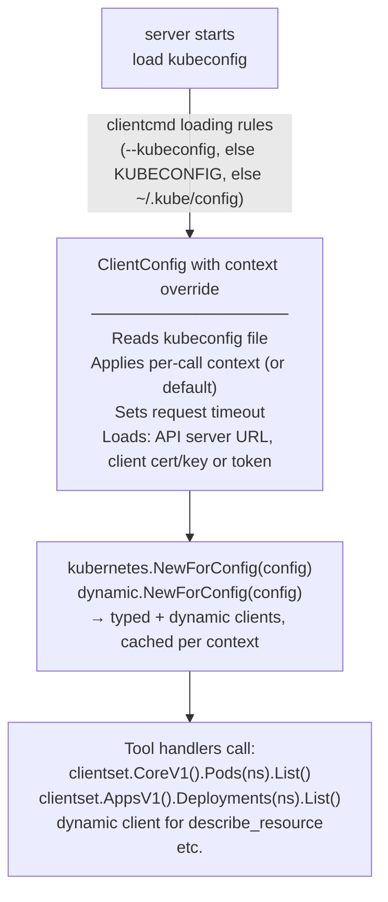
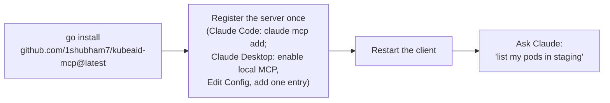

# Kubeaid MCP Server - High Level Design

## Overview

A local Go binary that sits between any MCP-compatible AI client (Claude Desktop,
Claude Code, Cursor, etc.) and a Kubernetes cluster. The AI talks to the MCP server
over stdio using the MCP protocol. The MCP server talks to the Kubernetes API server
using `client-go`. The user never writes a `kubectl` command.

---

## 1. System Context

Where the MCP server sits relative to everything else.

---

## 2. End-to-End Request Flow

What happens from the moment a user types a question to when they get an answer.

---

## 3. MCP Protocol Handshake

What happens at the transport level when the AI client first spawns your binary.

---

## 4. Internal Architecture of the MCP Server

How the Go binary is structured internally.

---

## 5. Multi-Cluster Configuration

A single server process serves every cluster in the kubeconfig. Rather than
launching one process per cluster, the server exposes a `list_contexts` tool and
gives every other tool an optional `context` parameter, so the AI picks the
cluster at call time. The `--context` flag only sets the *default* used when a
call omits one; when the flag is omitted, the default tracks the kubeconfig's
current-context live (re-read from disk each call), so `kubectl config
use-context` switches the target mid-session without a restart. Clients are
built and cached per context on first use, so switching clusters
mid-conversation needs no restart.

---

## 6. Tool Inventory

Every tool the server exposes and what it calls. All tools additionally accept
an optional `context` parameter to target a specific kubeconfig context; the
`namespace` parameter is optional on the list tools (omit to span all
namespaces).

### Write tools (opt-in)

The tools above are read-only and always registered. Mutating tools are
registered only when the server is started with `--allow-writes`, and exec only
with `--allow-exec`. Every mutation is refused on any context named in
`--protected-context`, and each accepts `dry_run` to simulate server-side.
Tools carry MCP annotations (`ReadOnlyHint` / `DestructiveHint`) so clients can
prompt before risky actions.

| Tool | Verb | Client |
|------|------|--------|
| `apply_manifest` | server-side apply (create/update) | dynamic |
| `patch_resource` | patch (strategic/merge/json) | dynamic |
| `delete_resource` | delete | dynamic |
| `scale_deployment` | update scale subresource | typed |
| `rollout_restart` | patch pod-template annotation | dynamic |
| `exec_command` | pod exec (SPDY stream) | rest.Config |

---

## 7. Kubeconfig Auth Flow

How the server authenticates to the Kubernetes API. It uses the kubeconfig on
disk (the same credentials `kubectl` uses); in-cluster service-account auth is a
possible future addition, not yet implemented.

---

## 8. Deployment & Installation

How a user gets this running in under 2 minutes.

