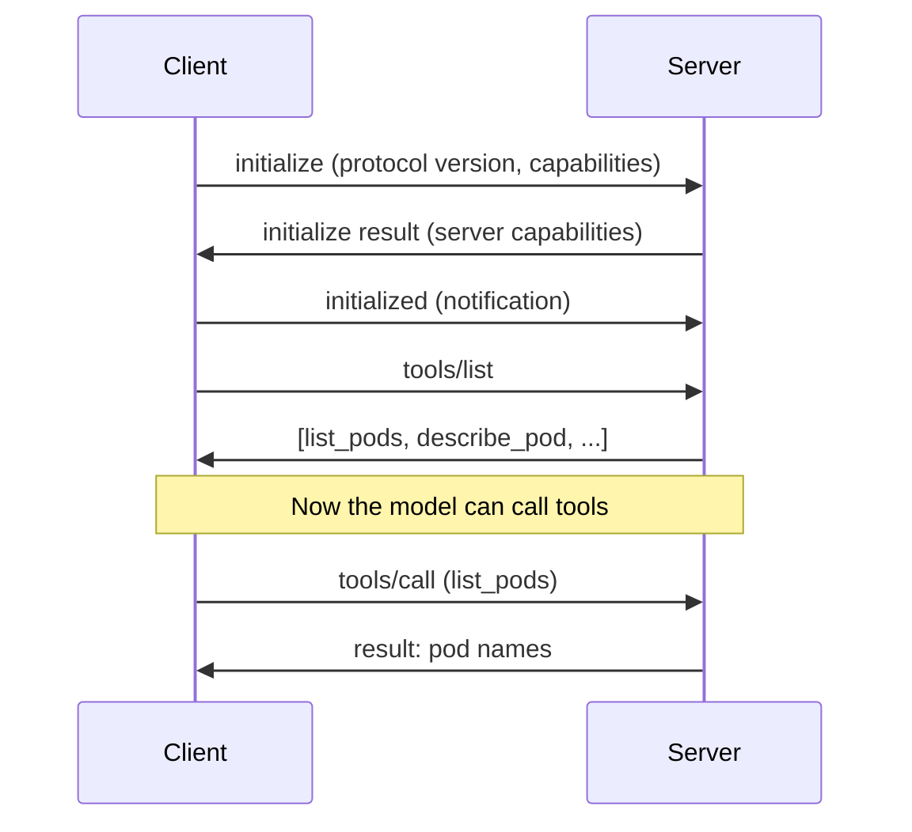

MCP (Model Context Protocol) is an open standard for connecting AI apps to external tools and data. Here's what it actually is, why it exists, and how it works under the hood.

## The problem it solves

Before MCP, every AI app that wanted to talk to an external tool needed its own custom integration for that tool. Claude needed a GitHub integration. Cursor needed its own GitHub integration. ChatGPT needed another one. Same tool, rebuilt separately for every app.

MCP standardizes the interface both sides talk to. Build a GitHub integration once, as an MCP server, and every MCP-compliant app can use it without extra work. Someone still has to build the server - but once, not once per app.

MCP was introduced by Anthropic in November 2024, created by David Soria Parra and Justin Spahr-Summers. It's inspired by LSP (Language Server Protocol) - the thing that lets `gopls` work identically across VS Code, Neovim, and JetBrains without each editor writing Go-specific code. MCP does the same thing for AI apps and tools. In December 2025, Anthropic donated MCP to the Agentic AI Foundation under the Linux Foundation, so it's now a vendor-neutral standard, not an Anthropic-owned one.

## Host, Client, Server

MCP has three roles:

- **Host** - the AI application you're using. Claude Desktop, Cursor, ChatGPT.
- **Client** - lives inside the host, one instance per connected server, handles the actual message passing.
- **Server** - the program exposing tools and data. It doesn't know or care which host it's plugged into, it just responds to messages.

A host spawns a separate client for every server it connects to.

## JSON-RPC and stdio

MCP messages are JSON-RPC 2.0 - just a spec for what a request and response look like:

```json
{
  "jsonrpc": "2.0",
  "id": 1,
  "method": "tools/call",
  "params": { "name": "list_pods", "arguments": { "namespace": "kube-system" } }
}
```

That's the message format. `stdio` is how the bytes actually travel for a local server. The host spawns the server as a subprocess and pipes messages through its stdin/stdout - the same stdin/stdout any CLI program uses. No networking, no ports. It's the same mechanism as `cat file.txt | grep something` - the shell wires one process's stdout to another's stdin using a kernel pipe. The host does this programmatically instead of a shell doing it.

The server's code doesn't change because of this. It's just: read a line from stdin, do the work, write a line to stdout, loop.

## The three primitives

MCP servers expose three kinds of things:

**Tools** - actions the model calls with parameters, on its own, mid-conversation. Something like `list_pods` or `get_pod_logs`. The model decides when to call them.

**Resources** - static-ish content the user attaches, like uploading a file. A server could expose something like `k8s://cluster/pods-snapshot` as a Resource. No parameters, no autonomous calling - the user picks it from a list, same as attaching a PDF to a chat.

**Prompts** - reusable instruction templates the user triggers, usually as a slash-command. A server could expose `/diagnose-crashloop`, which expands into a full, well-written diagnostic prompt so the user doesn't have to write it themselves.

Quick way to remember it: **Tools are verbs, Resources are nouns, Prompts are pre-packaged sentences.**

## The handshake

Before any tool can be called, client and server negotiate:



This whole exchange happens before you type a single message - it's why Claude Desktop shows a brief "connecting" state when it spawns a server.

## Building one in Go

The [official Go SDK](https://github.com/modelcontextprotocol/go-sdk) handles the protocol part - framing, the handshake, generating schemas - so a working server is less code than you'd expect. Here's the shape of it, using the Kubernetes server I built as the example.

You create a server, register some tools on it, and run it over a transport. For a local server that transport is stdio:

```go
func main() {
    server := mcp.NewServer(&mcp.Implementation{
        Name:    "kubeaid-mcp",
        Version: "0.1.0",
    }, nil)

    registerTools(server)

    // Run blocks, reading requests from stdin and writing replies to stdout.
    if err := server.Run(context.Background(), &mcp.StdioTransport{}); err != nil {
        log.Fatal(err)
    }
}
```

One thing to get right before anything else: your logs go to stderr, not stdout. stdout is the protocol's channel, and a single stray line there breaks the JSON framing. It's the first way a new server usually falls over.

A tool is a Go struct for its input plus a function. You don't write JSON Schema by hand - you tag the struct fields, and the SDK reflects them into the schema the model reads:

```go
type listPodsInput struct {
    Namespace string `json:"namespace,omitempty" jsonschema:"namespace to list pods in; omit for all namespaces"`
}

type listPodsOutput struct {
    Pods []podSummary `json:"pods"`
}
```

The handler gets the typed input and returns the typed output:

```go
func listPods(ctx context.Context, req *mcp.CallToolRequest, in listPodsInput) (*mcp.CallToolResult, listPodsOutput, error) {
    pods, err := clientset.CoreV1().Pods(in.Namespace).List(ctx, metav1.ListOptions{})
    if err != nil {
        return nil, listPodsOutput{}, err
    }

    var out listPodsOutput
    for _, p := range pods.Items {
        out.Pods = append(out.Pods, podSummary{
            Name:     p.Name,
            Status:   podStatus(&p),      // derived, not just p.Status.Phase
            Restarts: totalRestarts(&p),
        })
    }
    return nil, out, nil
}
```

Note what it returns - not the raw pod objects. A single pod is hundreds of lines of YAML, and handing all of it back buries the few fields the model actually needs under a wall of noise it has to pay for in tokens. Deciding what to leave out is most of the work in writing a good tool.

Registering it wires the input and output types to the handler:

```go
mcp.AddTool(server, &mcp.Tool{
    Name:        "list_pods",
    Description: "List pods in a namespace, with status, restart count and age.",
}, listPods)
```

That description does more than it looks like. The model picks which tool to call from the name and description alone - it never sees your code - so a vague one gets skipped or misfired.

Because it's all just JSON over stdin/stdout, you can test the whole thing from a terminal, no AI app involved:

```bash
printf '%s\n' \
  '{"jsonrpc":"2.0","id":1,"method":"initialize","params":{"protocolVersion":"2025-06-18","capabilities":{},"clientInfo":{"name":"cli","version":"0"}}}' \
  '{"jsonrpc":"2.0","method":"notifications/initialized"}' \
  '{"jsonrpc":"2.0","id":2,"method":"tools/call","params":{"name":"list_pods","arguments":{"namespace":"kube-system"}}}' \
  | ./kubeaid-mcp
```

Watching the raw request and response go by once takes most of the mystery out of MCP. (One gotcha: piping everything in at once closes stdin immediately, and the server can exit on EOF before it replies. A real client holds the connection open - a small script that writes a message, reads the reply, then writes the next behaves the same way.)

That's the entire loop. Prompts and resources hang off the same server with `AddPrompt` and `AddResource`, but tools are where most of the value is.

## Security - what MCP does not do

MCP is a message format, not a security system. The spec says hosts must get user consent before invoking a tool, but it can't enforce that - it's guidance, not a runtime guarantee. That "allow this tool to run?" popup you see in Claude Desktop is the host's own UI layer, not part of the protocol itself.

This matters more the closer a tool gets to mutating state. A read-only tool going wrong is annoying; a tool that can delete or modify things going wrong is a production incident. A malicious or poorly-described tool from some other server in the same session can also try to manipulate the model into calling tools it shouldn't (prompt injection via tool descriptions) - worth keeping in mind when pulling in third-party MCP servers.

The ecosystem is actively hardening this. Enterprise-Managed Authorization is now stable and being adopted by Anthropic, Microsoft, and Okta, and the next spec revision moves authorization closer to standard OAuth 2.0/OIDC instead of every host inventing its own flow.
